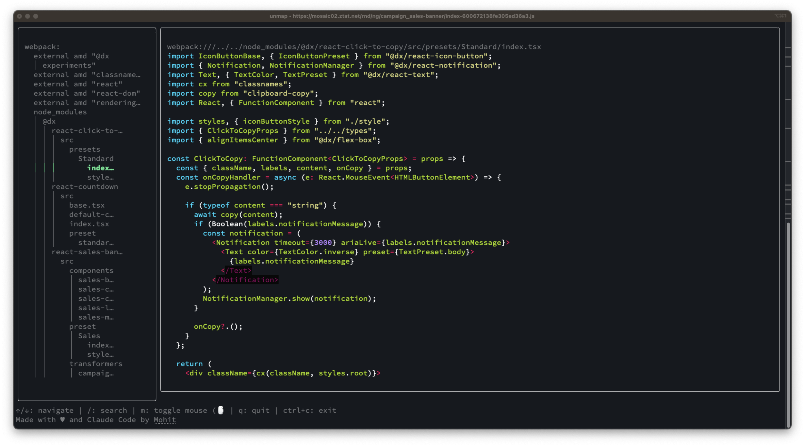

# unmap

CLI tool for un-minifying and exploring obfuscated JavaScript files

## Usage

Choose a binary from the `build` directory and use it as follows:

```sh
Usage: unmap <url> [-H "Authorization: Bearer token"] [--sourcemap <sourcemap-url>]

# Fetches JS file, parses source map URL and downloads source maps. Uses any headers provided.
Example: unmap https://example.com/app.js -H "Authorization: Bearer token123"

# Uses the provided files to unminify JS file
Example: unmap https://example.com/app.js -H "Authorization: Bearer $(get_token)" --sourcemap https://example.com/app.js.map
```



## Search

Use `/` to enter search mode to look through the source code.